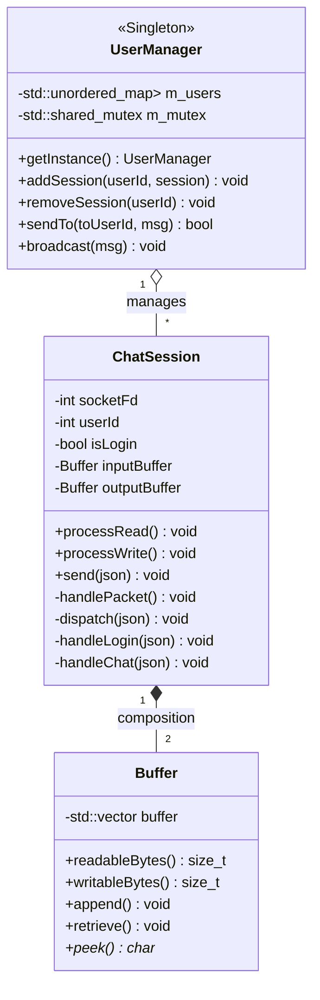
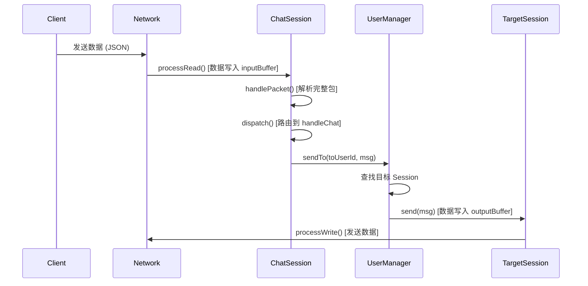

# Chat 模块架构文档

`chat` 模块实现了一个基于非阻塞 I/O 的实时消息系统。该模块负责处理用户连接、消息协议解析（基于 JSON）、会话管理以及消息路由。

## 核心组件架构

### 1. Buffer (`buffer.h`, `buffer.cpp`)
专为非阻塞 I/O 设计的动态字节缓冲区。

*   **职责**: 管理从套接字读取和写入的原始数据。
*   **特性**:
    *   **自动扩容**: 类似于 `std::vector`，根据数据量自动增长。
    *   **读写指针管理**: 维护 `readPos` 和 `writePos` 指针，高效处理数据流。
    *   **头部预留 (Cheap Prepend)**: 预留头部空间，方便在数据前添加协议头（如长度字段）而无需移动数据。
    *   **字节序处理**: 提供网络序与主机序转换的辅助函数 (`appendInt32`, `peekInt32`)。

### 2. ChatSession (`chat.h`, `chat.cpp`)
代表一个客户端连接会话。

*   **职责**: 处理单个用户的生命周期、协议解析和业务逻辑分发。
*   **输入/输出**: 内部拥有 `inputBuffer` 和 `outputBuffer` 两个缓冲区实例。
*   **消息处理流程**:
    1.  `processRead()`: 从 Socket 读取数据到 `inputBuffer`。
    2.  `handlePacket()`: 尝试解决粘包/半包问题，解析出完整的 JSON 消息。
    3.  `dispatch()`: 根据消息类型（如 login, chat, heartbeat）将 JSON 对象分发给对应的处理函数。
*   **状态管理**: 维护用户的登录状态 (`isLogin`)、用户 ID (`userId`) 和最后活跃时间（用于心跳检测）。

### 3. UserManager (`usermanager.h`, `usermanager.cpp`)
全局的会话管理器（单例模式）。

*   **职责**: 维护所有在线用户的会话列表，提供线程安全的操作接口。
*   **功能**:
    *   **会话管理**: `addSession` / `removeSession`，使用读写锁 (`std::shared_mutex`) 保证并发安全。
    *   **消息路由**: `sendTo(userId, msg)` 查找目标用户的会话并转发消息。
    *   **广播**: `broadcast(msg)` 向所有在线用户发送消息。
    *   **监控**: 提供获取在线人数和用户列表的接口。

## 架构图 (Mermaid)

## 消息处理时序图

以下展示了一个用户发送聊天消息的处理流程：

