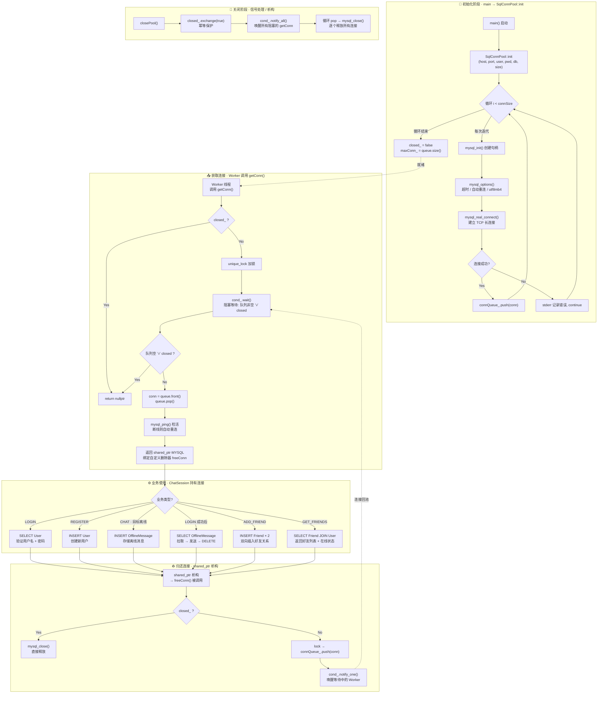

# MySQL 连接池 — 业务逻辑流程

## 一、整体架构

```
┌──────────────┐     getConn()      ┌──────────────────┐    mysql_query()   ┌─────────┐
│ Worker Thread │ ──────────────── → │   SqlConnPool    │ ← ─ ─ ─ ─ ─ ─ →  │  MySQL  │
│ (ChatSession) │ ← ─ shared_ptr ── │  (connQueue_)    │    长连接复用       │  Server │
└──────────────┘   析构时自动归还    └──────────────────┘                    └─────────┘
```

> 核心思想：**预创建 N 条长连接放入队列，Worker 线程按需借用，用完自动归还，全程无需手动管理连接生命周期。**

---

## 二、完整业务流程图



---

## 三、关键设计要点

### 1. RAII — 零泄漏连接管理

```cpp
// getConn() 返回的 shared_ptr 绑定了自定义删除器
return std::shared_ptr<MYSQL>(conn, [this](MYSQL* c) {
    this->freeConn(c);  // 析构时自动归还，而非 mysql_close
});
```

调用方只需：
```cpp
auto conn = SqlConnPool::getInstance().getConn();
mysql_query(conn.get(), "SELECT ...");
// 离开作用域 → shared_ptr 析构 → freeConn → 连接回池
```

### 2. 线程安全 — mutex + condition_variable

| 操作 | 锁类型 | 说明 |
|---|---|---|
| `getConn()` | `unique_lock` + `cond_.wait()` | 队列空时阻塞，有归还时被唤醒 |
| `freeConn()` | `lock_guard` + `cond_.notify_one()` | 归还后唤醒一个等待者 |
| `closePool()` | `lock_guard` + `cond_.notify_all()` | 关闭时唤醒所有等待者令其退出 |

### 3. 连接检活 — mysql_ping

每次取出连接时调用 `mysql_ping()`，配合 `MYSQL_OPT_RECONNECT` 选项，若连接已断开则自动重连，对业务层透明。

### 4. 幂等关闭 — atomic exchange

```cpp
if (closed_.exchange(true)) return; // 多次调用 closePool() 只执行一次
```

---

## 四、数据表 Schema

| 表名 | 核心字段 | 用途 |
|---|---|---|
| **User** | `id`, `username`, `password`, `nickname` | 账号鉴权 |
| **Friend** | `userid`, `friendid`, `create_time` | 双向好友关系 |
| **OfflineMessage** | `id`, `to_userid`, `from_userid`, `content`, `send_time` | 离线消息暂存 |

建表脚本: `mysql/init_db.sql`
